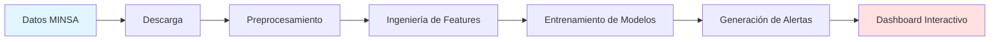

<div align="center">

# 🦟 SIDET - Sistema Inteligente de Detección Temprana de Dengue

### Detección temprana de brotes de dengue en Perú usando Machine Learning e Inteligencia Artificial

[](https://www.python.org/downloads/)
[](https://streamlit.io)
[](https://opensource.org/licenses/MIT)
[](https://www.datosabiertos.gob.pe/)

</div>

---

## 📋 Descripción del Proyecto

**SIDET** es un sistema avanzado de detección temprana de brotes anómalos de dengue en las regiones endémicas del Perú. Utiliza técnicas de **Machine Learning**, **Deep Learning** y **análisis estadístico** para identificar patrones anómalos y generar alertas predictivas multinivel.

El sistema combina múltiples modelos de predicción (SARIMA, Prophet, LSTM, XGBoost) en un **ensemble inteligente** que proporciona:
- ✅ Detección de anomalías en tiempo real
- ✅ Predicciones futuras de casos de dengue (2026-2028+)
- ✅ Sistema de alertas por niveles de riesgo (Normal, Bajo, Medio, Alto, Crítico)
- ✅ Dashboard interactivo con visualizaciones avanzadas
- ✅ Validación de modelos con métricas de rendimiento

---

## 🎯 Características Principales

### 🔍 Detección de Anomalías
- **Isolation Forest**: Detección de patrones anómalos
- **Local Outlier Factor (LOF)**: Identificación de outliers locales
- **One-Class SVM**: Clasificación de normalidad vs anomalía
- **Consenso de Modelos**: Sistema de votación para mayor precisión

### 📈 Modelos Predictivos
- **SARIMA**: Análisis de series temporales estacional
- **Prophet**: Modelo de Facebook para forecasting
- **LSTM**: Redes neuronales recurrentes para secuencias
- **XGBoost**: Gradient boosting para predicciones robustas

### 🚨 Sistema de Alertas Multinivel
| Nivel | Descripción | Z-Score | Acción |
|-------|-------------|---------|--------|
| 🟢 Normal | Sin desviación significativa | < 1.5σ | Monitoreo rutinario |
| 🟡 Bajo | Desviación leve | 1.5-2.0σ | Vigilancia aumentada |
| 🟠 Medio | Desviación moderada | 2.0-2.5σ | Preparación de recursos |
| 🔴 Alto | Desviación alta | 2.5-3.0σ | Activación de protocolos |
| 🟣 Crítico | Desviación crítica | > 3.0σ | Respuesta inmediata |

### 📊 Dashboard Interactivo
- Visualizaciones en tiempo real con Streamlit
- Mapas regionales interactivos
- Gráficos de series temporales
- KPIs y métricas clave
- Filtros por región y rango de fechas

---

## 🗺️ Regiones Objetivo

El sistema monitorea las 5 regiones más endémicas del Perú:

- 🌴 **Loreto** - Región amazónica con alta incidencia
- 🏖️ **Piura** - Costa norte con brotes estacionales
- 🌳 **Ucayali** - Selva central con transmisión continua
- 🌿 **San Martín** - Selva alta con patrones estacionales
- ⛰️ **Junín** - Región de transición con brotes emergentes

---

## 🚀 Inicio Rápido

### Requisitos Previos
- Python 3.10 o superior
- pip (gestor de paquetes de Python)
- Git

### Instalación

1. **Clonar el repositorio**
```bash
git clone https://github.com/tu-usuario/sidet-dengue-peru.git
cd sidet-dengue-peru
```

2. **Crear y activar entorno virtual**
```bash
# Windows
python -m venv venv
.\venv\Scripts\activate

# Linux/Mac
python3 -m venv venv
source venv/bin/activate
```

3. **Instalar dependencias**
```bash
pip install -r requirements.txt
```

4. **Descargar y procesar datos**
```bash
# Descargar datos del MINSA
python src/data/01_download_minsa_data.py

# Preprocesar datos
python src/data/02_preprocess_data.py

# Crear características
python src/features/04_create_features.py

# Entrenar modelos
python src/models/05_train_anomaly_models.py

# Generar alertas
python src/models/06_generate_alerts.py
```

5. **Iniciar el dashboard**
```bash
streamlit run dashboard/app.py
```

El dashboard se abrirá automáticamente en `http://localhost:8501`

---

## 📁 Estructura del Proyecto

```
sidet_dengue_peru/
├── 📂 data/                    # Datos del proyecto
│   ├── raw/                   # Datos originales del MINSA
│   ├── processed/             # Datos procesados y limpios
│   └── external/              # Datos complementarios
│
├── 📂 src/                     # Código fuente
│   ├── data/                  # Scripts de descarga y procesamiento
│   ├── features/              # Ingeniería de características
│   ├── models/                # Modelos de ML/AI
│   ├── visualization/         # Generación de gráficos
│   └── utils/                 # Utilidades generales
│
├── 📂 dashboard/               # Aplicación web Streamlit
│   ├── app.py                 # Aplicación principal
│   ├── assets/                # Recursos (logo, imágenes)
│   └── static/                # Archivos estáticos
│
├── 📂 models/                  # Modelos entrenados
│   └── saved/                 # Archivos .pkl de modelos
│
├── 📂 reports/                 # Reportes y visualizaciones
│   ├── figures/               # Gráficos generados
│   └── pdfs/                  # Reportes en PDF
│
├── 📂 notebooks/               # Jupyter notebooks
│   ├── 01_exploratory/        # Análisis exploratorio
│   ├── 02_preprocessing/      # Preprocesamiento
│   ├── 03_modeling/           # Desarrollo de modelos
│   └── 04_evaluation/         # Evaluación y validación
│
├── 📂 tests/                   # Tests unitarios
│
├── 📄 requirements.txt         # Dependencias del proyecto
├── 📄 config.py               # Configuración general
├── 📄 README.md               # Este archivo
├── 📄 GUIA_USUARIO.md         # Guía detallada de usuario
└── 📄 RESUMEN_EJECUTIVO.md    # Resumen ejecutivo del proyecto
```

---

## 🛠️ Tecnologías Utilizadas

### Lenguaje y Entorno
- **Python 3.10+** - Lenguaje principal

### Análisis de Datos
- **pandas** - Manipulación de datos
- **numpy** - Computación numérica
- **scipy** - Análisis estadístico

### Machine Learning
- **scikit-learn** - Modelos de ML clásicos
- **xgboost** - Gradient boosting
- **TensorFlow/Keras** - Deep Learning (LSTM)
- **statsmodels** - Series temporales (SARIMA)
- **prophet** - Forecasting de Facebook

### Visualización
- **matplotlib** - Gráficos estáticos
- **seaborn** - Visualizaciones estadísticas
- **plotly** - Gráficos interactivos
- **folium** - Mapas interactivos

### Dashboard
- **Streamlit** - Aplicación web interactiva

---

## 📊 Fuente de Datos

- **Dataset Principal**: Vigilancia Epidemiológica de Dengue - CDC Perú (2000-2024)
- **Fuente**: Ministerio de Salud del Perú (MINSA)
- **URL**: [Datos Abiertos del Gobierno del Perú](https://www.datosabiertos.gob.pe/dataset/vigilancia-epidemiológica-de-dengue)
- **Licencia**: Open Data Commons Attribution License
- **Actualización**: Semanal

---

## 📖 Documentación Adicional

- 📘 **[Guía de Usuario](GUIA_USUARIO.md)** - Manual completo de uso del sistema
- 📗 **[Resumen Ejecutivo](RESUMEN_EJECUTIVO.md)** - Resumen técnico del proyecto
- 📙 **[Dashboard Design](dashboard/DESIGN_IMPROVEMENTS.md)** - Mejoras de diseño del dashboard

---

## 🔄 Pipeline de Procesamiento



---

## 🧪 Testing y Validación

El sistema incluye validación exhaustiva de modelos:

- **Backtesting**: Validación con datos históricos
- **Métricas de Rendimiento**: MAE, RMSE, MAPE
- **Cross-Validation**: Validación cruzada temporal
- **Consenso de Modelos**: Votación entre múltiples algoritmos

---

## 🤝 Contribuciones

Las contribuciones son bienvenidas. Para contribuir:

1. Fork el proyecto
2. Crea una rama para tu feature (`git checkout -b feature/AmazingFeature`)
3. Commit tus cambios (`git commit -m 'Add some AmazingFeature'`)
4. Push a la rama (`git push origin feature/AmazingFeature`)
5. Abre un Pull Request

---

## 📝 Licencia

Este proyecto está bajo la Licencia MIT - ver el archivo [LICENSE](LICENSE) para más detalles.

Los datos utilizados provienen del MINSA y están bajo Open Data Commons Attribution License.

---

## 👨‍💻 Autor

**Joel** - Proyecto de Detección Temprana de Dengue en Perú

---

## 🙏 Agradecimientos

- **MINSA (Ministerio de Salud del Perú)** - Por proporcionar datos abiertos de calidad
- **CDC Perú** - Por la vigilancia epidemiológica continua
- **Comunidad Open Source** - Por las herramientas y librerías utilizadas

---

## 📞 Soporte

Para preguntas, sugerencias o reportar problemas:
- 📧 Abre un [Issue](https://github.com/tu-usuario/sidet-dengue-peru/issues)
- 📖 Consulta la [Guía de Usuario](GUIA_USUARIO.md)

---

<div align="center">

**⚠️ Nota Importante**: Este sistema es una herramienta de apoyo a la toma de decisiones. Las alertas generadas deben complementarse con análisis epidemiológico profesional y no reemplazan el criterio médico.

---

Hecho con ❤️ para mejorar la salud pública en Perú

</div>
